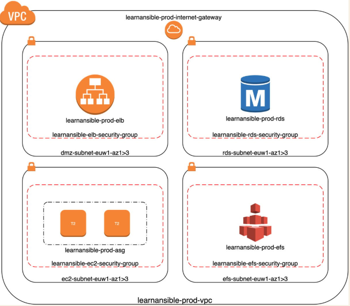

# ansible-playbook-AWS-Networks-Services

Before we launch virtual machine instances, we must create a network to host them. This is called a virtual private cloud (VPC) and there are a few different elements we will need to bring together in a playbook to create one, which we will then be able to use for our instances.

```
$ export AWS_ACCESS_KEY=<access_key>
$ export AWS_SECRET_KEY=<secret_key>
$ ansible-playbook -i hosts site.yml
$ ansible-playbook -i hosts destroy.yml
```



#### VPC, subnets, internet gateway, routing, and security groups: These are all needed to launch our deployment.

#### The Application Elastic Load Balancer: We will be using the public hostname of the Elastic Load Balancer for our installation, so this needs to be launched before we start our installation.

#### The RDS database instance: Our database instance must be available before we launch our installation, as we need to create the WordPress database and bootstrap the installation.

#### The EFS storage: We need some storage to share between the EC2 instances we will be launching next.
